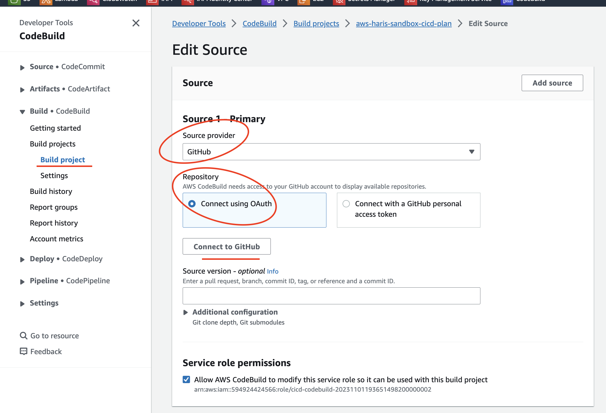
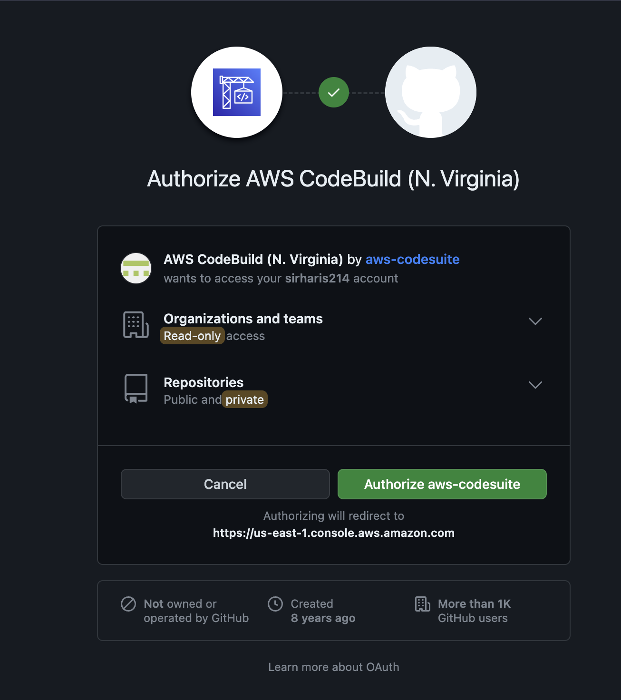
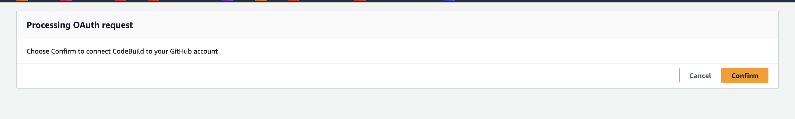
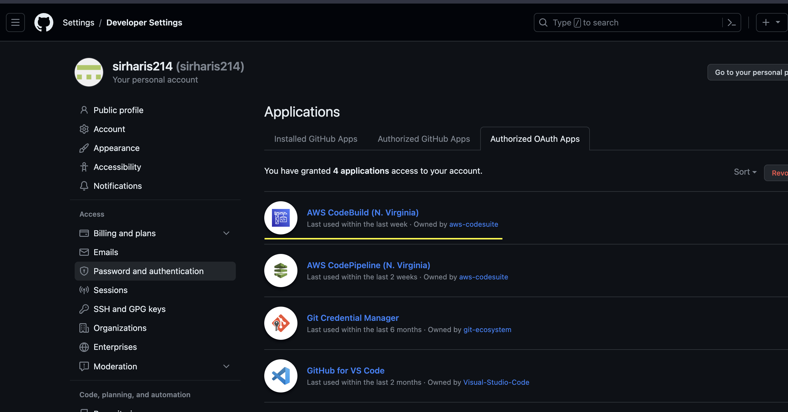
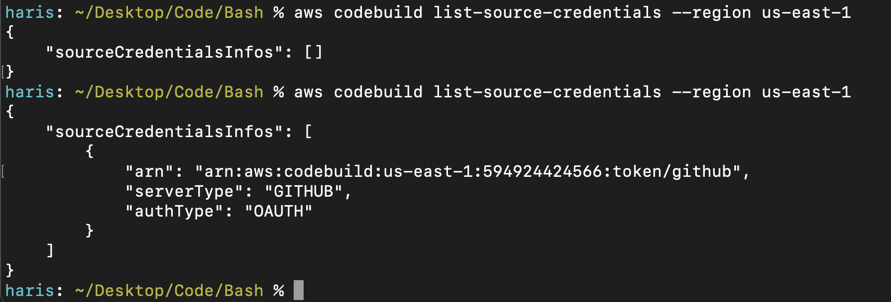

    

# Index
* [GitHub](./docs/github/)
  - How to download and config git
  - Repo's branching explination
  - Repo's merge-flow explination
  - Release version convention
* [Terraform](./docs/terraform/)
  - How to download terraform
* [AWS](./docs/aws/)
  - How to install and configure aws-cli-v2
  - How to configure aws sso to authenticate aws-cli to your AWS account
  - How to create IAM Identity Center Groups and Users from console
  - aws sso authentication helper script
* [Tools](./docs/tools/)

# Infrastructure
* [IAM Identity Center](./docs/iam_identity_center/)
  - Additional permission required to run terraform plan [additional_permissions_tf_plan.md](./docs/iam_identity_center/docs/additional_permissions_tf_plan.md)

# CI/CD

* [Code source](#code-source)
* [Code artifacts](#code-artifacts)
* [Infrastructure](#infrastructure)
* [Webhook](#webhook)
* [Config provider for cicd repo & modules]()

We are currently using AWS CodeBuild Projects for our CI/CD.


# Disclaimer :warning:

This CI/CD is not ment to be a practical and ideal CI/CD setup. I have purposely broken this into 2 seperate GitHub repo's and 2 seperate AWS CodeBuild Projects, with one of them requiring to be triggered manually. The purpose of this CI/CD was to learn and document how AWS CodeBuild is used to pull code from GitHub and run terraform plan/apply on that code in AWS to create the infrastructure.

The ideal CI/CD would be wrap these 2 CodeBuild projects within a AWS Codepipline and integrate notifications and manual terraform-plan validation which would automatically trigger the CodeBuild apply project. 

The ideal setup would also be have ci/cd apply the webhook to the current repo instead of a secondary repo [aws-haris-sandbox-cicd](https://github.com/sirharis214/aws-haris-sandbox-cicd). 

# Pre-reqs

* Manually create a secret in AWS Secrets Manager 
    - Secret Name: `CodeBuild.AwsHarisSandbox.TerraformManagement`
        - key-value 1: `external_id` = `any-unique-string`
        - key-value 2: `role_arn`    = `ARN of the role used to create infra via ci/cd`
    - After infrastructure is created, we must update the permissions to this Secret
        - grant IAM Role `cicd-codebuild-xxx` to access this secret

> role_arn value is the role ARN of `aws-haris-sandbox-cicd-terraform-management`, it will have to be added after creating the infrastructure which creates this role.

Example Resource Permission for Secret:
```hcl
{
  "Version" : "2012-10-17",
  "Statement" : [ {
    "Effect" : "Allow",
    "Principal" : {
      "AWS" : "arn:aws:iam::594924424566:role/cicd-codebuild-xxx"
    },
    "Action" : "secretsmanager:GetSecretValue",
    "Resource" : "arn:aws:secretsmanager:us-east-1:594924424566:secret:CodeBuild.AwsHarisSandbox.TerraformManagement-TcTxxq"
  } ]
}
```

* Webhook 
    - If this is the first time creating a CodeBuild webhook from this AWS account/region to your GitHub, you must perform a one time manual process from the AWS console to grant CodeBuild OAuth permission to the GitHub account.
    - see [Webhook](#webhook) section for more details

## Code Source

When configuring the provider for the repo that will be used as the source for ci/cd, add a `assume_role` config and set the role_arn and external_id values as variables shown below. 

When CodeBuild pulls this repo into it's environment it also adds 2 environmental variables which have the values for these variables. CodeBuild gets the values from AWS Secrets Manager and due to the environmental variables naming convention, terraform automatically picks up the values and assigns it to these variables.[^1]

Configuring provider:
```hcl
provider "aws" {
  # Update with your desired region
  region = "us-east-1"
  assume_role {
    role_arn     = var.ROLE_ARN
    external_id  = var.EXTERNAL_ID
    # repo-branch ; module-workspace
    session_name = "aws-haris-sandbox-cicd-dev"
  }
}
```

Variable values get set during CodeBuild plan - build spec's environment configuration. 
This is why we must update the permission of AWS Secret Manager secret to grant the role `cicd-codebuild-xxx` access to the secret, it is the role CodeBuild uses to create the environment which also access's AWS Secret Manager. 

```hcl
version: 0.2
env:
  secrets-manager:
    TF_VAR_EXTERNAL_ID: "CodeBuild.AwsHarisSandbox.TerraformManagement:external_id"
    TF_VAR_ROLE_ARN: "CodeBuild.AwsHarisSandbox.TerraformManagement:role_arn"
...

```

## Code Artifacts

During CodeBuild Plan, we export all the artifacts into artifact's S3 bucket. This also includes the plan output file (`plan.out`) that CodeBuild Apply can use to run `terraform apply`. 

* The artifacts for CodeBuild Plan are stored under: `Bucket/<CICD_REPO_NAME>/plan`

During CodeBuild Apply, the source is configured to be the one mentioned above, this way CodeBuild Apply has access to the plan output file.

* The artifacts for CodeBuild Apply are stored under: `Bucket/<CICD_REPO_NAME>/apply`

## Infrastructure

CI/CD has 2 phases of infrastructure creation. 

* First phase creates the resources that a CodeBuild project depends on.
    - Artifacts S3 Bucket
    - IAM Role assumed by provider config in ci/cd repo
        - permissions to create any resource in AWS account
        - permission to be assumed by CodeBuild's role `cicd-codebuild-xxx` (created in next phase)
* Second phase create the actual CodeBuild project resource and other resources
    - CodeBuild project resource
    - CodeBuild webhook
    - IAM Role that CodeBuild resource assumes to create CodeBuild project and access resources to configure its environment
        - access AWS Secret Manager
        - access Artifacts S3 bucket
        - permission to assume the role from phase-1 (`aws-haris-sandbox-terraform-management`)
        - permission to manage the remote statefile S3 bucket
        - permission to create CW log-groups

## Webhook 

When working with GitHub source for a CodeBuild webhook, the CodeBuild service will automatically create (on aws_codebuild_webhook resource creation) and delete (on aws_codebuild_webhook resource deletion) the GitHub repository webhook using its granted OAuth permissions.[^2]

This requires that CodeBuild be granted OAuth permission to GitHub account via a manual process in AWS Console per-region, this must be done before creating webhook with terraform resource.

## CodeBuild: Authorize OAuth to GitHub

Once you create the CodeBuild project using the resource `aws_codebuild_project` in terraform, navigate to the AWS console where this CodeBuild project was created. Here are the manual steps you must follow to grant CodeBuild OAuth permission to your GitHub inorder for CodeBuild to create the Webhook.
> This needs to be done manually once per-region. Next time you want to create a webhook for another CodeBuild project via terraform aws_codebuild_webhook resource, this manual step will not be required.

1. Go to the `Build details` tab of the CodeBuild project
2. Under `Source`, click **Edit**
3. Under `Repository` 
    - Select **Connect using OAuth** 
    - Click **Connect to GitHub**
4. A Github Window will pop-up prompting you to authorize CodeBuild-*REGION_NAME* to access GitHub Account
    - Click **Authorize aws-codesuite**
5. You will be brought back to AWS Console to confirm connection of CodeBuild to GitHub Account
    - Click **Confirm**

Now we can use terraform to create the webhook for this CodeBuild project using the resource `aws_codebuild_webhook`.





## Confirm CodeBuild OAuth to GitHub

### GitHub Console

In the GitHub console, we can confirm CodeBuild has access to the GitHub account.

1. Navigate to Developer Settings > Applications > Authorized OAuth Apps



### AWS-CLI

`aws codebuild list-source-credentials --region us-east-1`



## CICD Usage
### Configure Terraform & AWS provider for CICD repo

The GitHub repository [aws-haris-sandbox-cicd](https://github.com/sirharis214/aws-haris-sandbox-cicd) is linked to the CodeBuild Plan project via a webhook. Any merge to the `dev` branch will automatically trigger the CodeBuild Plan project. We will create various other GitHub repo's which will be terraform modules that create resources in AWS. In the CICD repo we will call those other GitHub repo's to create instances of those modules, to create resources in our aws account via ci/cd. More on this in the cicd repo's documentation [here](https://github.com/sirharis214/aws-haris-sandbox-cicd#introduction). The terraform configurations for those modules is shown in the section below.

The following is the terraform and aws provider configuration that you should follow in the repo:

aws-haris-sandbox-cicd's **main.tf** content:
```hcl
terraform {
  # Terraform core should be pinned to a minor version
  required_version = "= 1.5.6"
  required_providers {
    # Providers should be pinned to a major version
    # The provider source should always be specified
    aws = {
      source  = "hashicorp/aws"
      version = "= 5.14.0"
    }
  }
  backend "s3" {
    region = "us-east-1"
    bucket = "aws-haris-sandbox20230828153749772900000001"
    key    = "terraform/aws-haris-sandbox-cicd/terraform.tfstate"
  }
}

provider "aws" {
  # Update with your desired region
  region = "us-east-1"
  assume_role {
    role_arn     = var.ROLE_ARN
    external_id  = var.EXTERNAL_ID
    session_name = "aws-haris-sandbox-cicd-dev" # repo-branch ; module-workspace
  }
}
```

### Configure Terraform for modules

In the CICD repo mentioned above, we will call various other github repo which are terraform modules. The following is the terraform configuration you should follow for those modules. See [secure-s3-bucket](https://github.com/sirharis214/secure-s3-bucket) as an example.

The provider config will come from the cicd repo itself but you still need to provide the providers source and version that your module uses. 

Module's **versions.tf** content:
```hcl
terraform {
  # Terraform core should be pinned to a minor version
  required_version = "= 1.5.6"
  required_providers {
    # Providers should be pinned to a major version
    # The provider source should always be specified
    aws = {
      source  = "hashicorp/aws"
      version = "= 5.14.0"
    }
  }
}
```

# References

[^1]: [Terraform Environment variables can be used to set variables](https://developer.hashicorp.com/terraform/cli/config/environment-variables#tf_var_name)
[^2]: [Terraform aws_codebuild_webhook](https://registry.terraform.io/providers/hashicorp/aws/latest/docs/resources/codebuild_webhook#bitbucket-and-github)
