# AWS IAM Identity Center

AWS IAM Identity Center uses a centralized aws management account to securely create and manage user access across AWS accounts. We enabled AWS Organization which automatically set the current account as the management account. Next we enabled AWS IAM Identity Center and created 2 Groups, `Admin` and `PowerUser`. Then we created 2 user's and added them to their respected groups. The next step was to create a [Permission Set](https://docs.aws.amazon.com/singlesignon/latest/userguide/permissionsetsconcept.html) for each group. Lastly we add the groups to the AWS account via AWS IAM Identity Center portal.

## PowerUser

We already created the admin resources, here are the steps we followed to create the power-user resources.

### Group

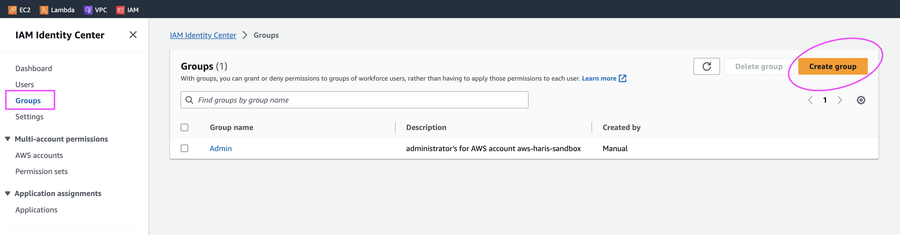

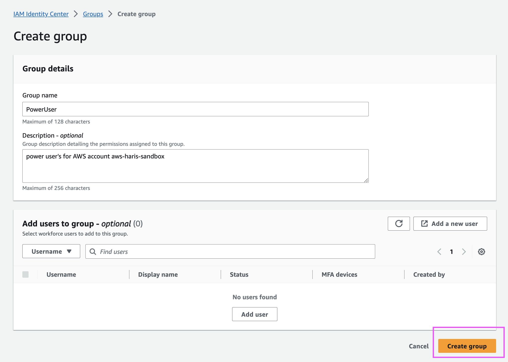

### User

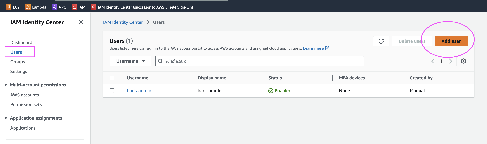

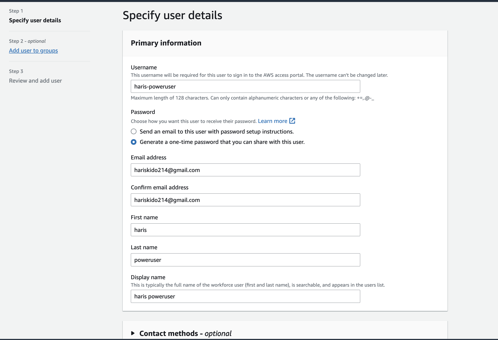

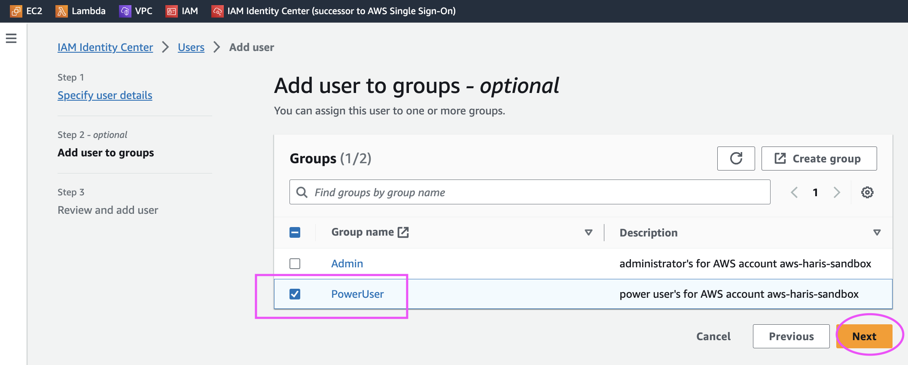

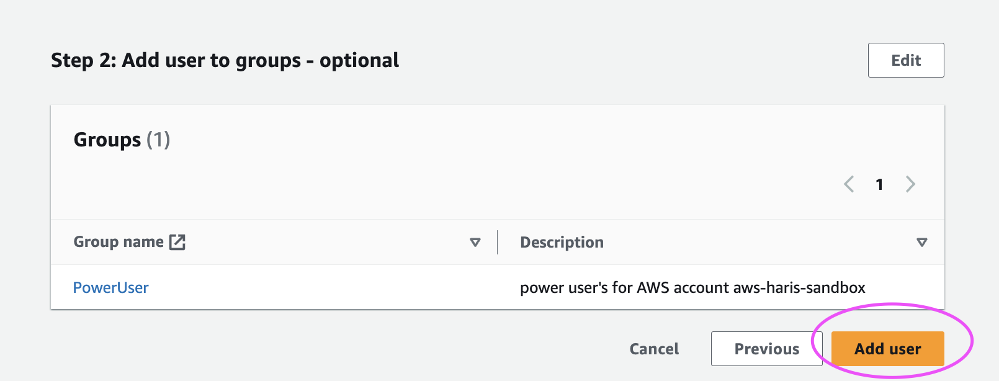

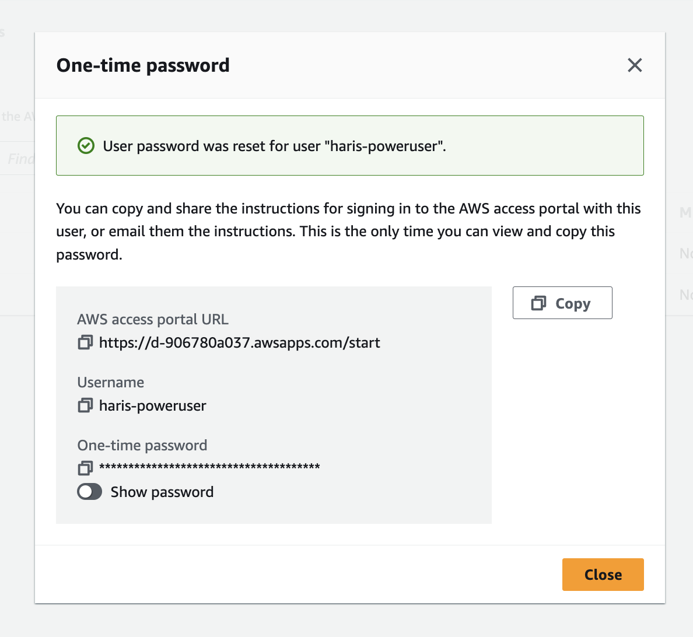

### Permission Set

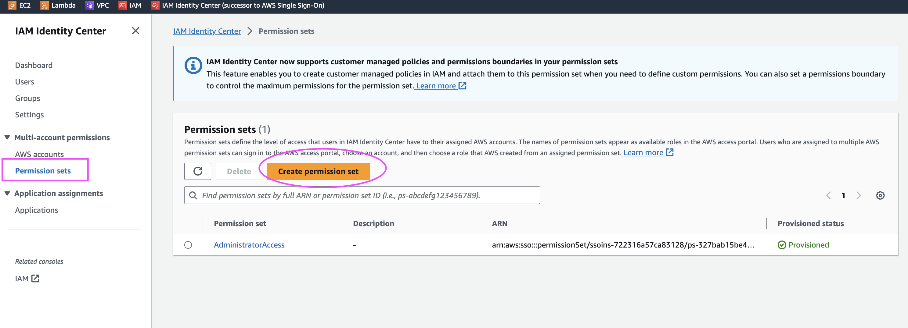

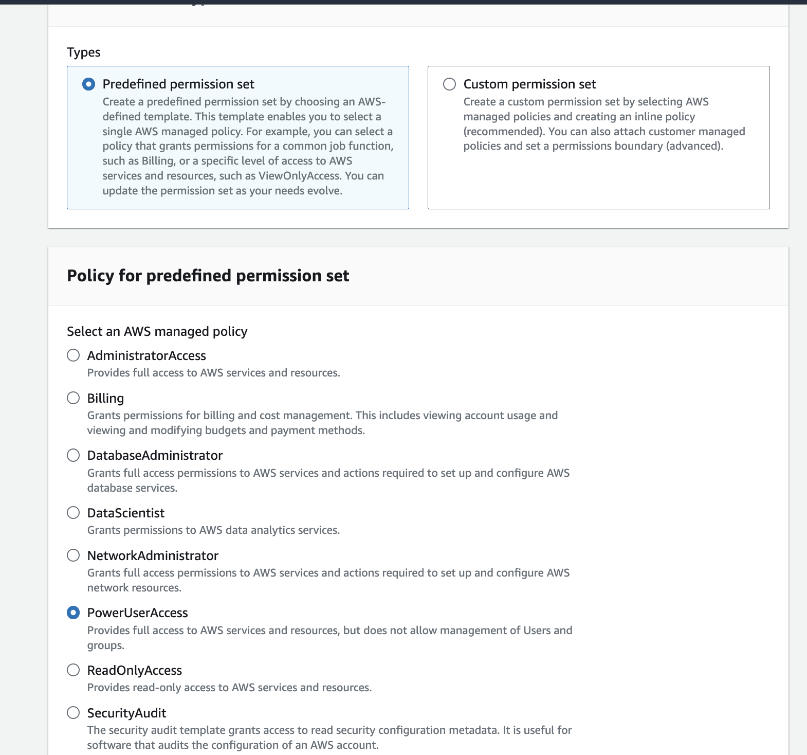

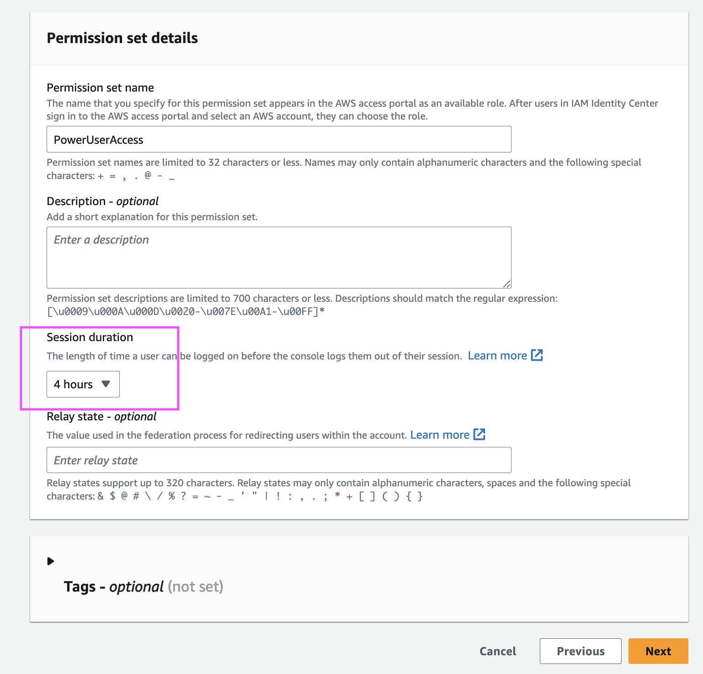

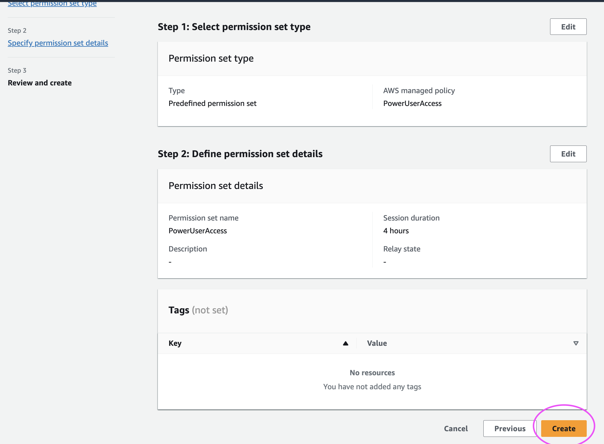

### Adding Group to Account 

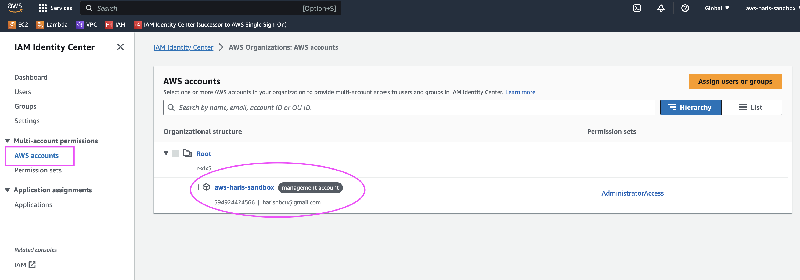

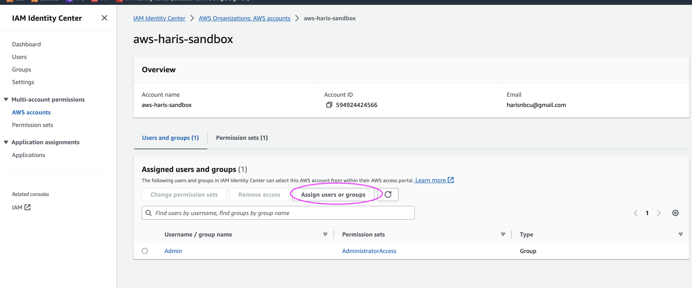

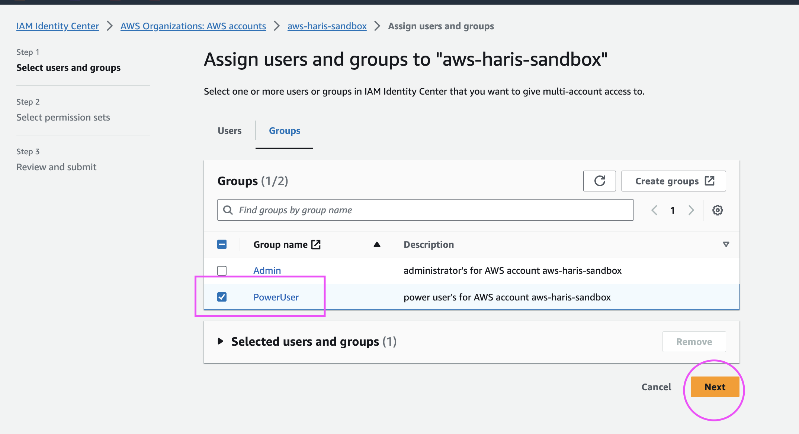

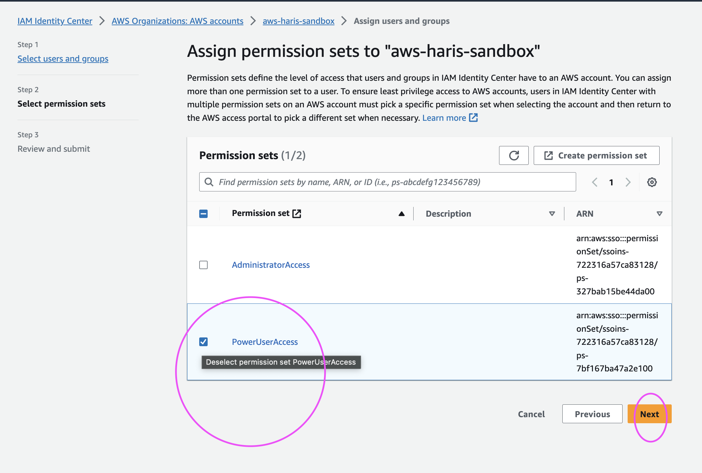

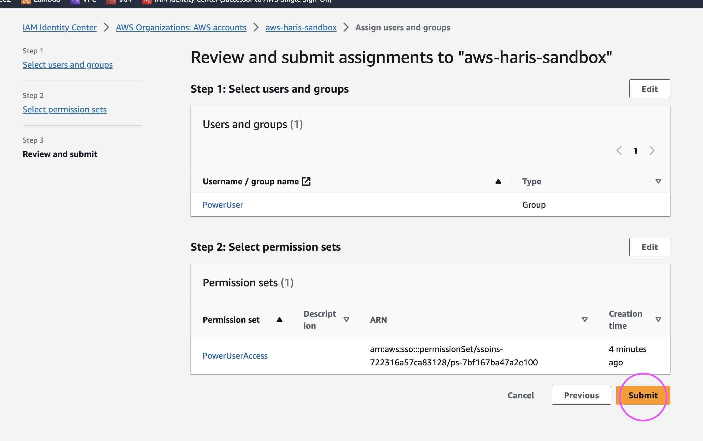
