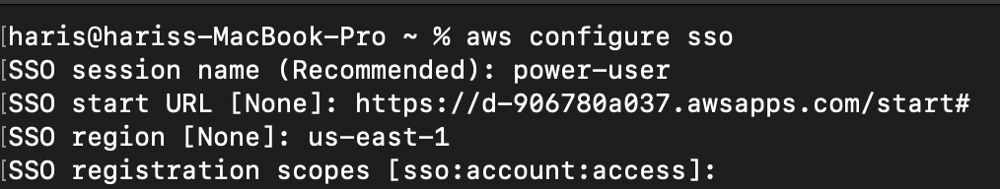
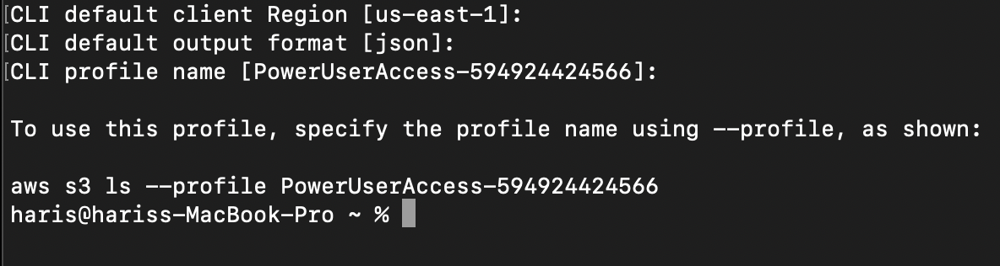

# AWS CLI v2 for AWS IAM Identity Center users

Set aws cli congiurations by running the command `aws config sso`

 

Set the values:
* SSO session Name: `power-user`
* SSO start URL: `https://d-906780a037.awsapps.com/start#`
* SSO region: `us-east-1`
* SSO registration scopes: `<ENTER>`

A windows will open in the default web browser where the user will have to auth into the aws account. Upon completion, a prompt will ask permission to Allow botocore-client to access your data, click "Allow". Back in the terminal, there will be a one time prompt to set the default CLI configurations 

> if you already ran the command `aws configure` to set default settings, you can hit `<ENTER>` on all these prompts to leave the values as is



Now you can run aws cli commands as long as you attach the profile using the flag `--profile`. 

You can get the profile name using the command `cat .aws/config | grep "profile"`

## CLI
List S3 Buckets: `aws s3 ls --profile PowerUserAccess-594924424566`

## Terraform

Configuring provider in terraform:
```shll
terraform {
  required_version = "= 1.5.6"
  required_providers {
    aws = {
      source  = "hashicorp/aws"
      version = "= 5.14.0"
    }
  }
}

provider "aws" {
  # Update with your desired region
  region  = "us-east-1"
  profile = "PowerUserAccess-594924424566"
}
```
