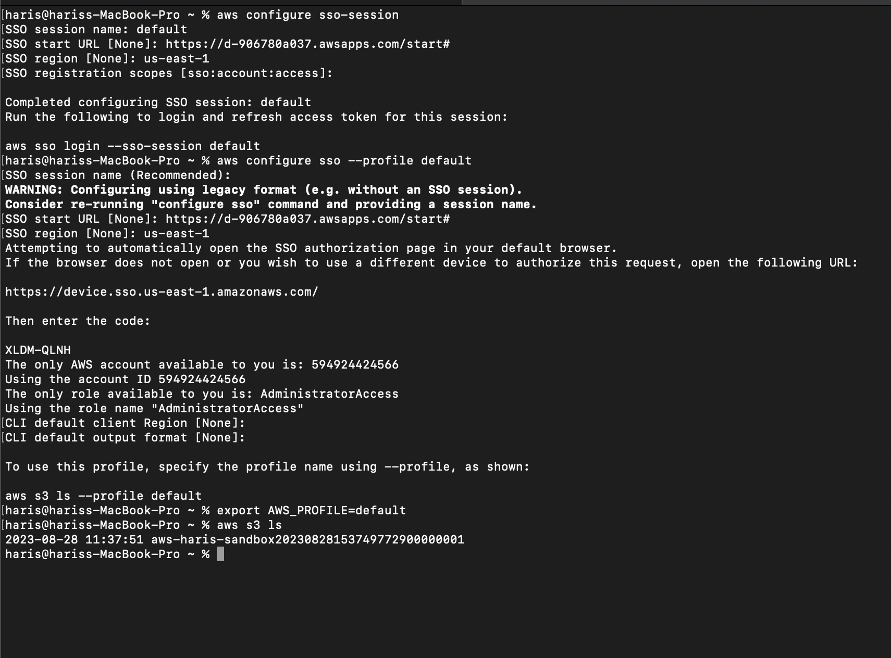
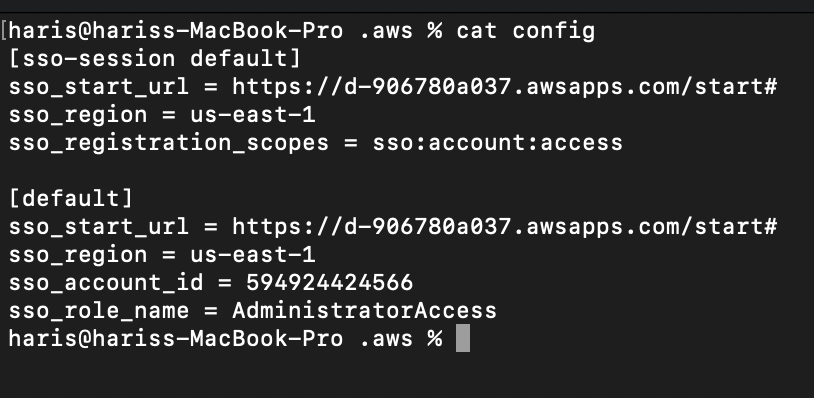
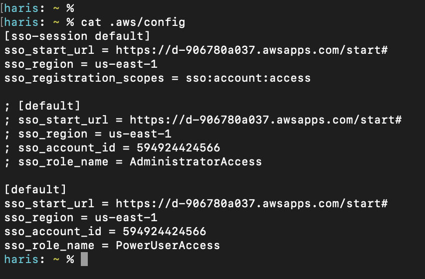
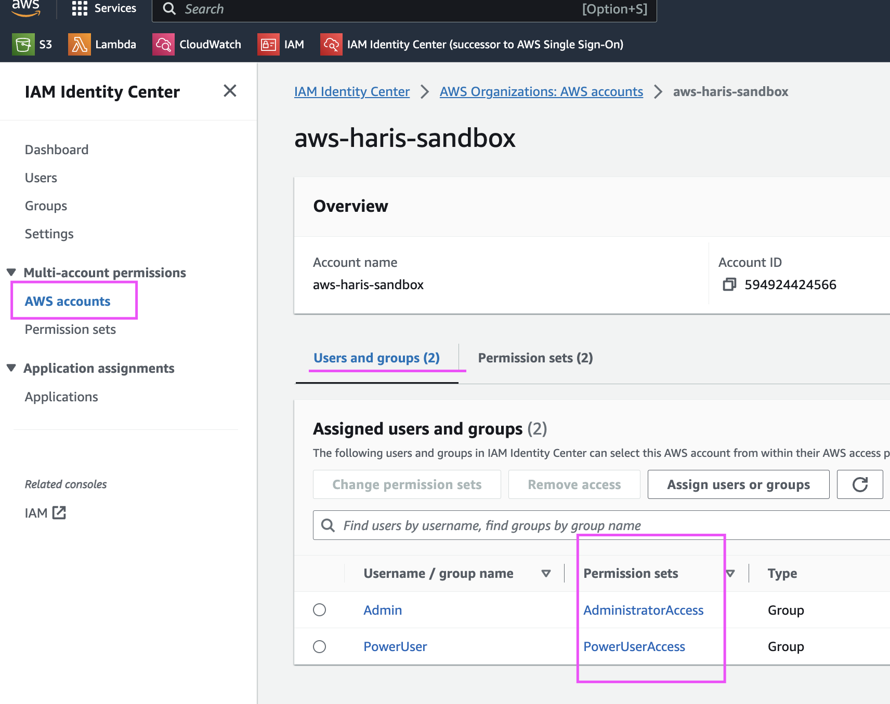

# aws sso config

New method of configuring AWS SSO + AWS CLI so we can run aws cli commands without having to add a flag for profile and run terraform without having to explicitly declare a provider profile.

# new aws sso config
1. `aws configure sso-session`
    - SSO session name: `default`
    - SSO start URL: `https://d-906780a037.awsapps.com/start#`
    - SSO region: `us-east-1`
    - SSO registration scopes: `<ENTER>` (leave blank)
2. `aws configure sso --profile default`
    - SSO session name: `<ENTER>` (leave blank)
    - SSO start URL: `https://d-906780a037.awsapps.com/start#`
    - SSO region: `us-east-1`
    - Web browser window will open to auth into AWS and allow botocore-client access to data.
    - CLI default region and output format can be left empty, so hit `<ENTER>`
3. run aws cli commands
    - `aws s3 ls`
    - run terraform without declaring provider profile

## heavy_exclamation_mark: Important 

During inital configuration when the web browser asked to auth into AWS, the user chose to login as an admin-user. This set the `sso_role_name` to `AdministratorAccess`, as the above image shows. If you were to do `aws sso logout` and login again via `aws sso login` and this time auth into AWS as a power-user, the `sso_role_name` value would have to manually be updated to the new role being assumed (`PowerUserAccess`). 

### upating .aws/config sso_role_name

Depending on the group the user belongs to:

* If the user logging in belongs to group: `Admin`, their `sso_role_name` will be `AdministratorAccess`
* If the user logging in belongs to group: `PowerUser`, their `sso_role_name` will be `PowerUserAccess`

There are 2 methods of updating the the `sso_role_name`. 

1. After completing AWS auth when running `aws sso login`, update the `sso_role_name` manually based on the user you logged in as.
    - you can utilize the script [change_sso_role_name](./change_sso_role_name.sh) 
    - update the option values as needed for your usecase
2. Create 2 `[default]` blocks where the `sso_role_name` values vary. Comment and uncomment the block's depending on which user your logged in as at that time

### Get SSO Role Name Values

`sso_role_name`'s are the name of the permission set when authenticated into the aws account. You can get the value options in IAM Identity Center. 

* Go to **AWS Accounts**
* Select the AWS account this login is for 
* Under **Users and Groups** > The permission set names are the value options for `sso_role_name`

